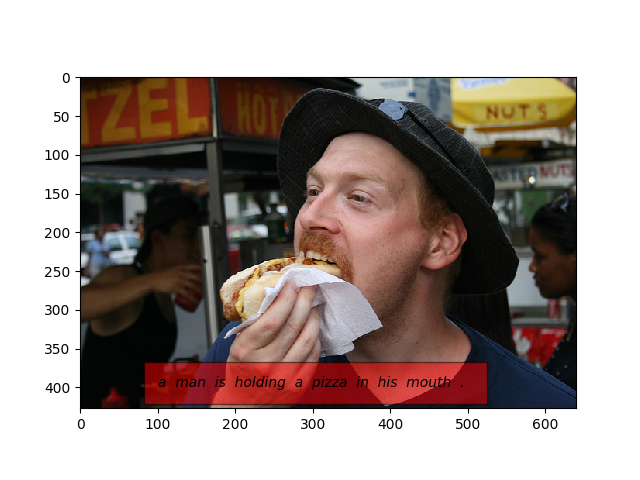
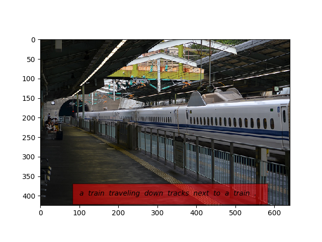

<h2>Image captioning</h2>

Image Captioning is the process of generating textual description of an image.
It uses both Natural Language Processing and Computer Vision to generate the captions.
So in this work I try to implement neural network that is capable of generating text given an image.

<h2> Network Architecture </h2>

In this work I use two different network one for extracting features from image and second is LSTM network for generating the text using that image.

<figure>

</figure>
<h2> Dataset. </h2>
The dataset used in this project is COCO dataset for image captioning 2015, I cannot upload dataset here but you can find it by clicking the link below.
Link: https://cocodataset.org/#download
<h2> File structure </h2>
<ul>
  <li> dataset.py :- This file contain the custom dataloader that return train data and test data.</li> 
  <li> vocabulary.py :- This file is used for creating the vocabulary. </li>
  <li> model.py  :- This file is basically where I define model and sample function for testing </li>
  <li> train.py :- This file is basically used for training the network </li>
  <li> test.py  :- As name suggest this file is for testing </li>
</ul>

<h2> Installation. </h2>  
  <ul>
  <li>Python==3.6.6</li>
  <li>Pytorch==1.6.0</li>
  </ul>

<h2> Predictions. </h2>
<figure>

</figure>
<figure>

</figure>

<h2> Important Note. </h2>

I am just the beginner and learning about this fascinating field, Please feel free to point out my mistake as well as feel free to contribute. 
Hope to upload more interesting project in future.

